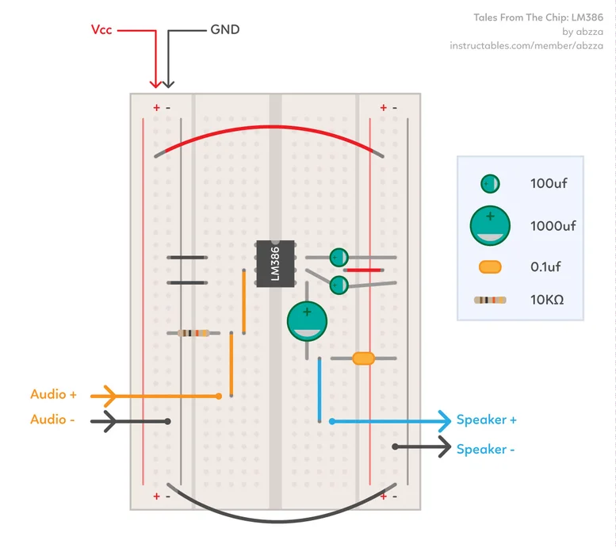
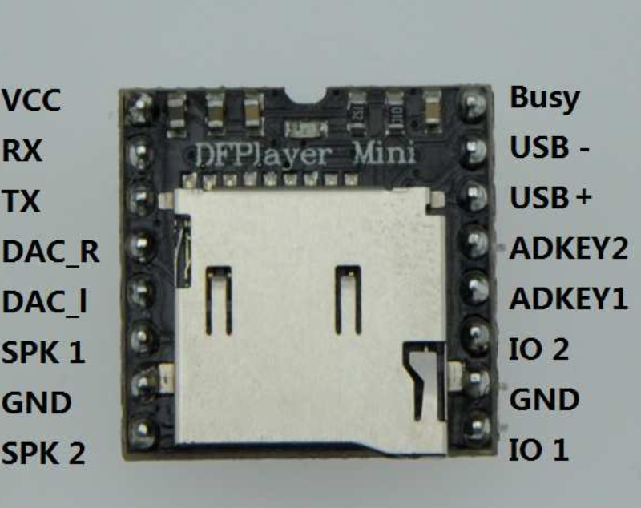
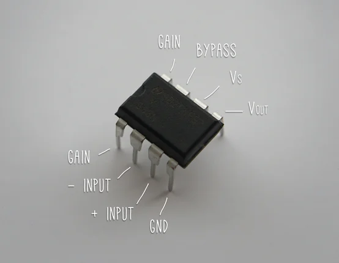

## Purpose

As a student, it would be wonderful if I can set alarm clocks for certain days in a week separately, like how I can with alarm apps. 
There are no alarm clocks like that on the market yet, however, and I also really don't want to have a smartphone in my bedroom to constantly distract me from sleep. 
Therefore, I deducted that the obvious and only solution is to make a alarm clock myself so that no more people will waste their time doing this knowing it's already been done by someone and use phones lying in their homes as a alarm clock instead. 
This is me planning out and documenting the process of that (project still in progress).
## Hardware

### Controller
- ATEMEGA328P
	- [Tutorial - Bare Bone System](https://www.instructables.com/Build-your-own-Arduino-Bare-Bone-System/)
	- 
	- 
### Display
 - 1.2" 4-Digit 7-Segment Display w/ I2C Driver
	 - [Wiring Tutorial](https://learn.adafruit.com/adafruit-led-backpack/1-2-inch-7-segment-backpack-arduino-wiring-and-setup)
 - 8 x 5050 RGB LED Stick
### Timer
- DS3231
### Sound
- DFPlayer Mini
	- [Datasheet](https://picaxe.com/docs/spe033.pdf)
	- RX + 1K resistor
	- 
- LM386
	- [Tutorial](https://www.instructables.com/Tales-From-the-Chip-LM386-Audio-Amplifier/)
	- 
	- 
	- I don't use the 0.1uf capacitor because for me it creates loud noise somehow
	- [YouTube - Sound Test at 5V](https://www.youtube.com/watch?v=o19-dUC6S-Y)
### Input
- Adafruit 5-way Navigation Switch
### Power Supply
- [Forum - Saving Power on Arduino](https://www.gammon.com.au/power)
- [Doc - MCUSR Register](https://onlinedocs.microchip.com/oxy/GUID-06C36746-0136-4691-8940-69BFD41FCC56-en-US-1/GUID-B79B6972-1C3C-4E51-A659-B13DB2DC6B62.html)
- [Doc - WDTCSR Register](https://onlinedocs.microchip.com/oxy/GUID-0EC909F9-8FB7-46B2-BF4B-05290662B5C3-en-US-12.1.1/GUID-0FE5D226-2F6B-4AAB-BA12-69A6E55F6E2B.html)
- [Datasheet - DC044A](https://www.lcsc.com/datasheet/lcsc_datasheet_2108131730_Korean-Hroparts-Elec-DC-044-20A_C136713.pdf)
### Case
	

| Supplier  | Item                                                                     | Price($NTD) | Link                                                                                                                                                                                        |
| --------- | ------------------------------------------------------------------------ | ----------- | ------------------------------------------------------------------------------------------------------------------------------------------------------------------------------------------- |
| Ruten     | ATEMEGA328P-PU                                                           | 149         | [🔗](https://www.ruten.com.tw/item/show?21647530414142)                                                                                                                                     |
| Ruten     | LM386 x 3                                                                | 9           | [🔗](https://www.ruten.com.tw/item/show?21647531181593)                                                                                                                                     |
| Ruten     | DIP-8 IC Socket                                                          | 1           | [🔗](https://www.ruten.com.tw/item/show?21647533630268)                                                                                                                                     |
| Ruten     | DS3231 Raspberry Pi Module                                               | 85          | [🔗](https://www.ruten.com.tw/item/show?21712564412274)                                                                                                                                     |
| Ruten     | 10K Resistor x 10                                                        | 3           | [🔗](https://www.ruten.com.tw/item/show?22343017274229)                                                                                                                                     |
| Ruten     | 1K Resistor x 10                                                         | 3           | [🔗](https://www.ruten.com.tw/item/show?22343017274229)                                                                                                                                     |
| ~~Ruten~~ | ~~100nF Capacitor x 10~~                                                 | ~~4~~       | ~~[🔗](https://www.ruten.com.tw/item/show?21647531597471)~~                                                                                                                                 |
| Ruten     | 100uF Capacitor x 10                                                     | 6           | [🔗](https://www.ruten.com.tw/item/show?21847033137504)                                                                                                                                     |
| Ruten     | 1000uF Capacitor x 2                                                     | 6           | [🔗](https://www.ruten.com.tw/item/show?21647531628443)                                                                                                                                     |
| Ruten     | XH2.54-3P 20cm Male + Female Cable                                       | 7           | [🔗](https://www.ruten.com.tw/item/show?21647533187018)                                                                                                                                     |
| Ruten     | XH2.54-5P 20cm Male + Female Cable                                       | 7           | [🔗](https://www.ruten.com.tw/item/show?21647533182541)                                                                                                                                     |
| Ruten     | KF301-2P Connector x 2                                                   | 2 x 2       | [🔗](https://www.ruten.com.tw/item/show?21647533607633)                                                                                                                                     |
| Shopee    | Official DFPlayer Mini Board                                             | 260         | [🔗](https://shopee.tw/%E7%8F%BE%E8%B2%A8-DFPlayer-Mini-MP3%E6%92%AD%E6%94%BE%E6%A8%A1%E7%B5%84-TF%E5%8D%A1-%E6%94%AF%E6%8F%B4MP3-WAV-WMA-DFRobot%E5%8E%9F%E5%BB%A0-i.10207300.23224105691) |
| ICShop*   | 8 x WS2812 5050 RGB LED Stick                                            | 15          | [🔗](https://www.icshop.com.tw/products/368011400509)                                                                                                                                       |
| Mouser    | Adafruit 1.2" 4-Digit 7-Segment Display w/ I2C Backpack - Yellow #1269   | 630         | [🔗](https://www.mouser.tw/ProductDetail/Adafruit/1269?qs=GURawfaeGuAAbBTnuv6RdQ%3D%3D)                                                                                                     |
| Mouser    | Adafruit Accessories Thru-hole 5-way Navigation Switch #504              | 70          | [🔗](https://www.mouser.tw/ProductDetail/Adafruit/504?qs=GURawfaeGuDZqvgMgBwIbQ%3D%3D)                                                                                                      |
| Mouser    | Joysticks Black Rubber Joystick Nubbin Cap for Navigation Joystick #4697 | 18          | [🔗](https://www.mouser.tw/ProductDetail/Adafruit/4697?qs=hWgE7mdIu5RXjf6tuH%2FSXA%3D%3D)                                                                                                   |

\*Can also be bought from the same seller as Ruten

# Contribution

This project isn't finished yet so the following is bullshit.

This is a personal project, so you can make issues and pull requests but I probably won't bother if it's not some critical issue affecting my daily usage of it.
If you want to make the same thing yourself for some reason, there are detailed instructions and schematics in the docs folder. The shopping links will probably not work for you though because most of them are from shopping websites in Taiwan, but the parts should still be common enough to easily get.